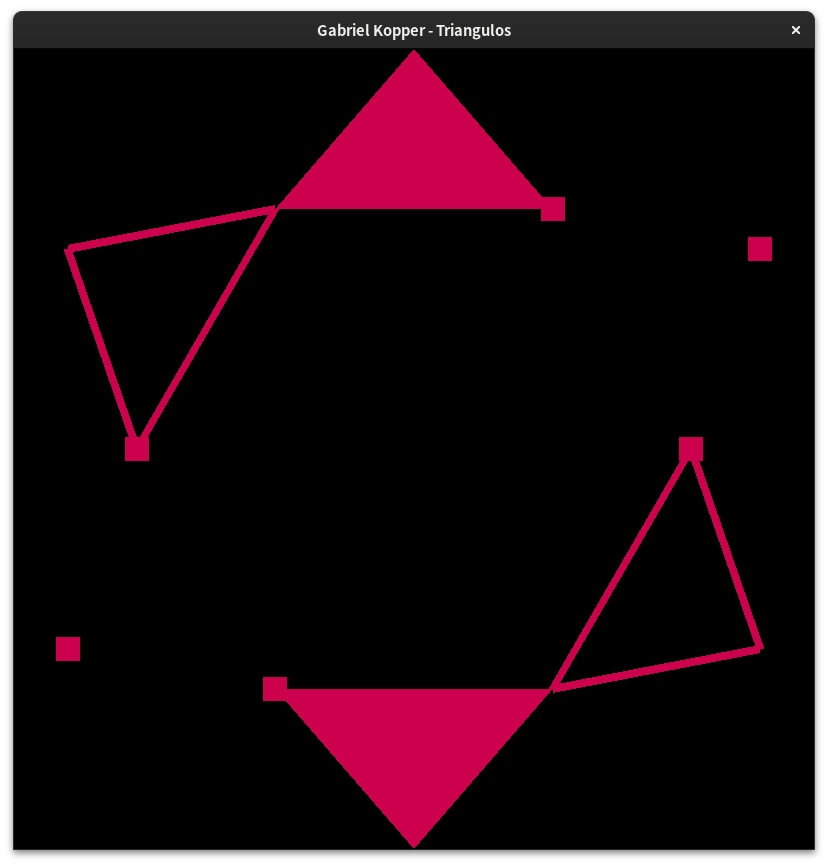
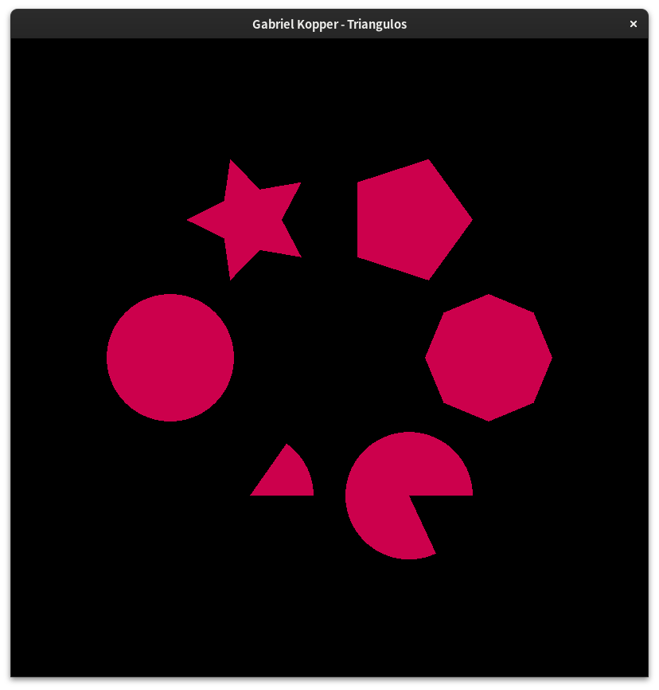
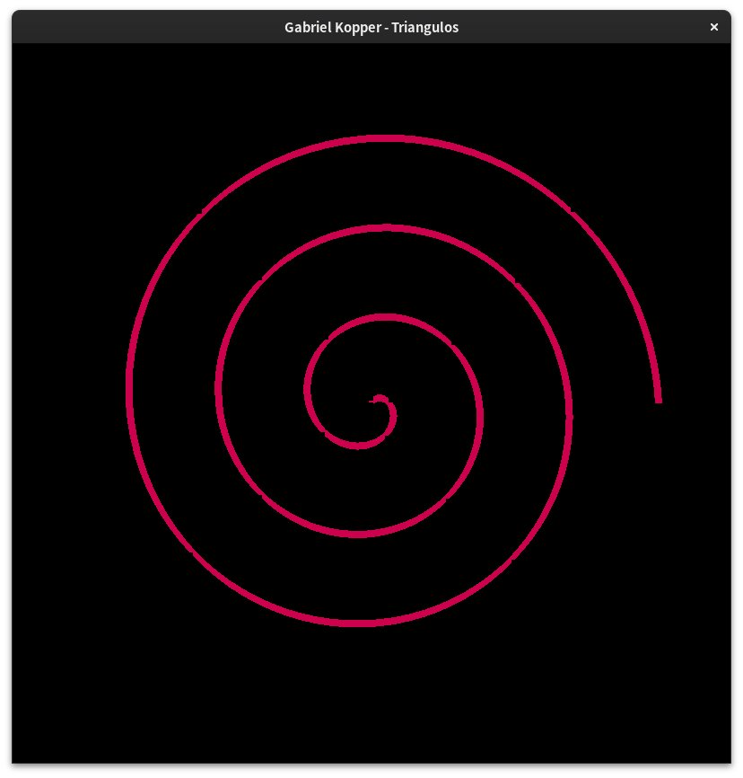

# Lista de exercícios 1

## 1. O que é a GLSL? Quais os dois tipos de shaders são obrigatórios no pipeline programável da versão atual que trabalhamos em aula e o que eles processam?

GLSL é a linguagem de programação de shaders criada pelo Khronos Group para uso
no OpenGL. Os shaders obrigatórios são o vertex shader e o fragment shader.
O vertex shader processar os vértices das formas geométricas que vamos desenhar,
a forma específica é especificada pela primitiva usada. O shader de fragmento 
define a cor de cada um dos fragmentos.

## 2. O que são primitivas gráficas? Como fazemos o armazenamento dos vértices na OpenGL?

As primitivas gráficas indicam para o OpenGL como desenhar nossos vértices.

Os vértices são, inicialmente, armazenados em buffers chamados *Vertex Buffer
Objects* e depois eles vão para a GPU.

## 3. Explicando VBOs, VAOs e EBOs

- VBO (Vertex Buffer Object):

- VAO (Vertex Array Object):

- EBO (Element Buffer Object):

## 4. sem entrega

## 5. Desenhando triângulos

[Fonte](src/cinco.cpp)

## 6. Círculos, estrelas e pizza

[Fonte](src/seis.cpp)

## 7. Espiral

[Fonte](src/sete.cpp)

## 8. Triangulo tri

[Fonte](src/oito.cpp)

## 9. Papel
