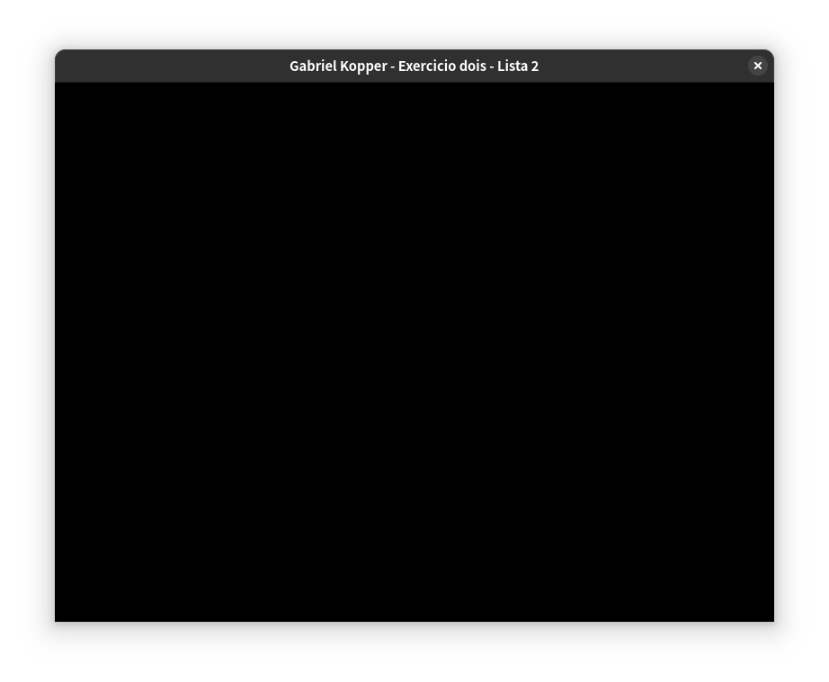

# Lista de exercícios 2

## 1. ortho(xmin=-10, xmax=10, ymin=-10, ymax=10)

[Fonte](apps/um.cpp)

## 2. ortho(xmin=0, xmax=800, ymin=600, ymax=0)

[Fonte](src/dois.cpp)

## 3. Utilizando a câmera 2D do exercício anterior, desenhe algo na tela. O que acontece quando posicionamos os objetos? Por que é útil essa configuração?

As imagens que desenhamos até agora estavam convidadas entre -1.0 e 1.0 em
ambas as direções. Ao mudarmos a janela do mundo para o mesmo tamanho da janela
em pixels temos 4 pixels para todo o desenho. Também estamos desenhando a
partir da origem, isso quer dizer que só teremos um quadrante do desenho e,
consequentemente, 1 pixel. Finalmente, temos a inversão do eixo y que implica
no espelhamento horizontal da imagem.

Tal configuração pode ser útil, pois assim podemos visualizar o que vamos
desenhar já que as coordenadas mapeiam diretamente para pixels. O espelhamento
horizontal pode ser usado para criar um espelho usando uma câmera dentro do
espelho e um estêncil como espelho.

## 4. viewport no primeiro quadrante

[Fonte](src/quatro.cpp)

## 5. Redesenhando em todos os quatrantes

[Fonte](src/cinco.cpp)

